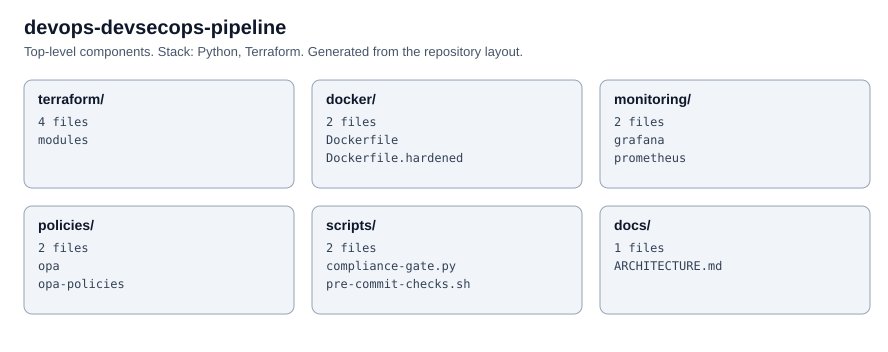

# ⚙️ Enterprise DevSecOps Pipeline Framework — Multi-Cloud CI/CD

> **Architect:** [Kehinde (Kenny) Samson Ogunlowo](https://github.com/kogunlowo123) | Principal AI Infrastructure & Security Architect  
> **Clearance:** Active Secret Clearance | [Citadel Cloud Management](https://citadelcloudmanagement.com)

[]()
[]()
[]()
[]()
[](LICENSE)

Production-grade DevSecOps CI/CD pipeline framework with integrated security scanning (SAST, DAST, SCA, secrets detection), IaC validation, compliance gates, and multi-cloud deployment automation. Based on implementations achieving **60% deployment time reduction** at Ceretax, **500+ vulnerabilities caught pre-production** across environments, and **200+ security incidents prevented annually** at Lockheed Martin.

---

## Pipeline Architecture

```
Developer Push
     │
     ▼
┌─────────────────────────────────────────────────────────────────┐
│                      SHIFT-LEFT SECURITY                        │
│  Pre-commit: gitleaks (secrets) | tflint | terraform fmt       │
├─────────────────────────────────────────────────────────────────┤
│                        CI PIPELINE                              │
│  ┌──────────┐  ┌──────────┐  ┌──────────┐  ┌────────────┐     │
│  │  Build   │  │   SAST   │  │   SCA    │  │  Secrets   │     │
│  │  & Test  │  │Semgrep   │  │ Trivy    │  │  GitGuard  │     │
│  │  Unit    │  │CodeQL    │  │ Snyk     │  │  Detect    │     │
│  └──────────┘  └──────────┘  └──────────┘  └────────────┘     │
├─────────────────────────────────────────────────────────────────┤
│                       IaC VALIDATION                            │
│  terraform validate | tflint | checkov | terraform plan        │
│  Terraform Sentinel policies | OPA policy checks               │
├─────────────────────────────────────────────────────────────────┤
│                     STAGING DEPLOY & DAST                       │
│  Terraform apply (staging) | OWASP ZAP DAST | Load testing    │
│  Integration tests | Contract tests | Performance baseline     │
├─────────────────────────────────────────────────────────────────┤
│                    PRODUCTION APPROVAL GATE                     │
│  Required reviewers | CODEOWNERS | Compliance attestation      │
│  Change management (ServiceNow/Jira) | Rollback plan           │
├─────────────────────────────────────────────────────────────────┤
│                      PRODUCTION DEPLOY                          │
│  Canary → Blue/Green → Full rollout | Automated rollback       │
│  Post-deploy validation | SLO/SLI checks | Alerting           │
└─────────────────────────────────────────────────────────────────┘
```

---

## Security Scanning Suite

| Tool | Type | Purpose |
|------|------|---------|
| **Semgrep** | SAST | Custom rules for cloud misconfigurations, injection, auth |
| **CodeQL** | SAST | Deep semantic code analysis for security vulnerabilities |
| **Trivy** | Container SCA | OS packages, language deps, Dockerfile misconfigurations |
| **Snyk** | SCA | Open-source dependency CVE detection with fix PRs |
| **GitGuardian** | Secrets | Pre-commit and historical secrets detection |
| **Checkov** | IaC SAST | Terraform, CloudFormation, Kubernetes security scanning |
| **TFLint** | IaC Lint | Provider-specific Terraform linting and best practices |
| **OWASP ZAP** | DAST | Active scanning of deployed endpoints in staging |
| **Prisma Cloud** | CSPM | Cloud Security Posture Management for runtime |
| **GitHub Advanced Security** | All-in-one | Secret scanning, code scanning, dependency review |

---

## Multi-Cloud Deployment Targets

| Cloud | Compute | IaC | Registry | CD Tool |
|-------|---------|-----|----------|---------|
| **AWS** | EKS, ECS, Lambda | Terraform, CloudFormation | ECR | CodeDeploy, ArgoCD |
| **Azure** | AKS, Container Apps | Terraform, Bicep | ACR | Azure DevOps, ArgoCD |
| **GCP** | GKE, Cloud Run | Terraform | Artifact Registry | Cloud Deploy, ArgoCD |

---

## Pipeline Implementations

### GitHub Actions (Primary)
```yaml
# .github/workflows/devsecops-pipeline.yml
on: [push, pull_request]
jobs:
  security-scan:       # Semgrep, CodeQL, Trivy, GitGuardian
  iac-validation:      # terraform validate, tflint, checkov
  build-and-test:      # Unit tests, integration tests
  staging-deploy:      # terraform apply + DAST
  production-deploy:   # Canary deployment with auto-rollback
```

### Azure DevOps
- Multi-stage YAML pipelines with approval gates
- Variable groups with Azure Key Vault integration
- Service connections for multi-cloud deployments
- Artifact feeds for internal libraries

### Cloud Build (GCP)
- Serverless CI with Cloud Build triggers
- Binary Authorization for container signing
- Artifact Registry for secure image storage
- Cloud Deploy for GKE progressive delivery

---

## Compliance Gates

All pipelines enforce:
- **No high/critical CVEs** in container images before deployment
- **No secrets** in code or IaC configurations
- **Terraform plan reviewed** and approved before apply
- **SBOM generated** for every container image artifact
- **Compliance report** attached to every production deployment
- **FIPS 140-2** validated encryption for all secrets management

---

## Production Metrics

- **60%** deployment time reduction at Ceretax via automated pipelines
- **500+** vulnerabilities caught pre-production via shift-left security
- **200+** security incidents prevented annually at Lockheed Martin
- **Monthly → Weekly** release cadence achieved at NantHealth
- **40%** deployment error reduction at NantHealth/Catalyte

---

## Repository Structure

```
devops-devsecops-pipeline/
├── .github/workflows/        # GitHub Actions pipeline definitions
├── terraform/                # IaC modules for pipeline infrastructure
├── docker/                   # Dockerfiles and compose configs
├── scripts/                  # Pipeline utility scripts
├── policies/                 # OPA/Sentinel/Checkov policy rules
├── monitoring/               # Observability stack configs
└── docs/                     # Architecture diagrams and runbooks
```

---

## Author
**Kehinde (Kenny) Ogunlowo** — [citadelcloudmanagement.com](https://citadelcloudmanagement.com) | kogunlowo@gmail.com | [LinkedIn](https://linkedin.com/in/kehinde-ogunlowo)

<!-- architecture -->
## Architecture


